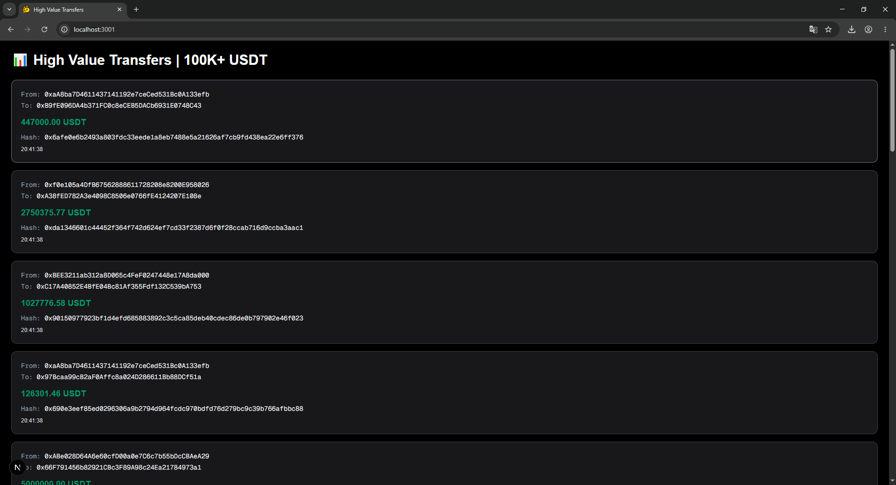

<h1 align="center" style="font-weight: bold;">USDT Transfer Monitoring System 💸</h1>
<p align="center">


</p>

<p align="center">
 <a href="#tech">Technologies</a> • 
 <a href="#started">Getting Started</a> • 
 <a href="#architecture">Architecture</a> •
 <a href="#features">Features</a> •
 <a href="#env">Environment</a> •
 <a href="#demo">Demo</a> •
 <a href="#notes">Notes</a> •
 <a href="#status">Status</a>
</p>

<p align="center">
    <b>
    A fullstack real-time monitoring system that listens Ethereum mainnet USDT transfers and sends Firebase push notifications when large transfers occur (≥ 100,000 USDT).
    </b>
</p>

---

<h2 id="tech">💻 Technologies</h2>

### Backend
- NestJS
- Ethers.js
- Firebase Admin SDK
- TypeScript
- Ethereum Mainnet (Alchemy RPC)

### Frontend
- Next.js
- Firebase Cloud Messaging (FCM)
- TypeScript

---

<h2 id="started">🚀 Getting started</h2>

### Prerequisites
- Node.js
- npm
- Git

---

### Cloning

```bash
git clone https://github.com/yasinziyali/usdt-transfer-monitor.git
cd usdt-transfer-monitor
```

---

### Installation

#### Backend
```bash
cd backend
npm install
```

#### Frontend
```bash
cd frontend
npm install
```

---

### Running the project

#### Backend
```bash
cd backend
npm run start
```

#### Frontend
```bash
cd frontend
npm run dev
```

---

<h2 id="architecture">🏗 Architecture</h2>

```text
⚡ SYSTEM FLOW

🟣 Ethereum Mainnet
        ↓
🟡 NestJS Event Listener (Ethers.js)
        ↓
🔴 Filter Engine (≥ 100k USDT)
        ↓
🟠 Firebase Cloud Messaging (FCM)
        ↓
🟢 Next.js Frontend UI
```

---

<h2 id="features">✨ Features</h2>

✔ Real-time USDT transfer monitoring  
✔ Ethereum mainnet event listening  
✔ High-value transaction detection (≥ 100k USDT)  
✔ Firebase push notification system  
✔ Frontend live notification UI  

---

<h2 id="env">🔐 Environment Variables</h2>

### Backend `.env`

This project requires sensitive configuration values to run properly.  
The `.env` file is **not included in the repository on purpose** for security reasons.

You must manually create a `.env` file inside the `backend/` directory using the structure below:

```env
ALCHEMY_RPC_URL=your_alchemy_rpc_url
FIREBASE_KEY_PATH=./your-firebase-admin-key.json
```

---

<h2 id="demo">📸 Demo / System Output</h2>

Below is a real example of the system in action.  
The application successfully detects high-value USDT transfers and displays real-time notifications on the frontend.

<p align="center">
  
</p>

> Live demonstration of real-time USDT transfer detection and Firebase push notifications.


<h2 id="notes">📌 Notes</h2>

- USDT contract decimals: **6**
- Contract Address:
```
0xdAC17F958D2ee523a2206206994597C13D831ec7
```

- Only transfers ≥ 100,000 USDT are processed
- Firebase is used for real-time push notifications

---

<h2 id="status">📊 Project Status</h2>

✔ Completed as a fullstack technical assessment task  
✔ Backend + Frontend integrated  
✔ Real-time blockchain monitoring active

---

> This project was developed as part of a fullstack technical assessment focused on real-time blockchain event processing.